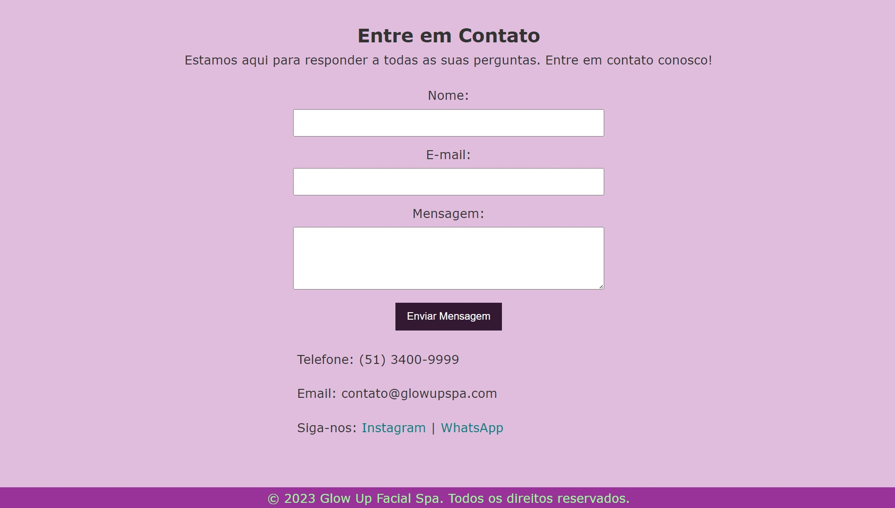

# Glow Up Facial Spa

Bem-vindo ao repositório do Glow Up Facial Spa, um site dedicado a apresentar os serviços e profissionais deste spa de estética facial de última geração. Nosso site tem como objetivo principal proporcionar uma visão abrangente da clínica de estética, indo além da busca pela beleza, visando também promover a autoestima e a saúde dos nossos clientes.

## Conteúdo

- [Visão Geral](#visão-geral)
- [Estrutura do Projeto](#estrutura-do-projeto)
- [Como Usar](#como-usar)  
- [Características](#características)  
- [Responsividade](#responsividade)
- [Realizadores do Projeto](#realizadores-do-projeto)
- [Contribuição](#contribuição)

## Visão Geral

O Glow Up Facial Spa é um site que destaca os tratamentos de estética facial oferecidos por profissionais altamente qualificados. O projeto inclui seções para apresentação, serviços, equipe médica e informações de contato. Exemplo do site abaixo:





## Estrutura do Projeto

- `index.html`: Página inicial do site.
- `css/`: Diretório contendo os arquivos CSS.
- `imagens/`: Diretório para armazenar imagens do site.
- `js/`: Diretório contendo os arquivos JavaScript.


  
## Como Usar

1. Clone o repositório:

   ```bash
   git clone https://github.com/vieiradaniels/glow-up-facial-spa.git

## Características

#### Formulário de Contato

- O formulário de contato e as informações associadas têm largura máxima de 400px e são centralizados.
- Botões têm aparência aprimorada ao passar o mouse.

```bash
 <section id="contact">
        <h2>Entre em Contato</h2>
        <p>Estamos aqui para responder a todas as suas perguntas. Entre em contato conosco!</p>

        <!-- Formulário de Contato -->
        <form action="#" method="post" id="contact-form">
            <label for="name">Nome:</label>
            <input type="text" id="name" name="name" required>

            <label for="email">E-mail:</label>
            <input type="email" id="email" name="email" required>

            <label for="message">Mensagem:</label>
            <textarea id="message" name="message" rows="4" required></textarea>

            <button type="submit">Enviar Mensagem</button>
        </form>

        <!-- Informações de Contato -->
        <div id="contact-info">
            <p>Telefone: (51) 3400-9999</p>
            <p>Email: contato@glowupspa.com</p>

            <!-- Links para Instagram e WhatsApp -->
            <p>
                Siga-nos:
                <a href="https://www.instagram.com/glowupspa" target="_blank">Instagram</a> |
                <a href="https://wa.me/551112345678" target="_blank">WhatsApp</a>
            </p>
        </div>
    </section>
```

#### Botão de Rolagem ao Topo

- Um botão "Voltar ao Topo" é fixado no canto inferior direito.
- Tem uma aparência atraente e é exibido ao rolar para baixo, desaparecendo quando no topo.

```bash
<button id="scrollTopButton" onclick="scrollToTop()">Voltar ao Topo</button>
```


## Responsividade

O site é responsivo e ajusta-se automaticamente a diferentes tamanhos de tela. O arquivo CSS contém regras de mídia para garantir uma experiência consistente em dispositivos móveis e desktop.

### Telas Pequenas (até 768px)

- O menu de navegação é centralizado e os itens são exibidos em bloco.
- O cabeçalho e seções têm padding reduzido.
- O texto em algumas seções é justificado e possui espaçamento para melhor legibilidade.
- As imagens têm largura de 100% do contêiner pai e são centralizadas.
 ```bash
 @media screen and (max-width: 768px) {
    header {
        padding: 10px 0;
    }

    section {
        padding: 10px;
    }

    footer {
        padding: 5px;
    }

    #home-presentation p,
    #services p,
    #team p,
    #presentation p,
    #contact-info p {
        margin-top: 10px;
        padding: 10px;
        text-align: justify;
    }

    #services .service img,
    #team img,
    #home-presentation img {
        width: 100%;
        /* Faz a imagem ocupar 100% da largura do contêiner pai */
        margin: 10px auto;
    }

    #services .service {
        flex-direction: column;
        /* Muda a direção da flexbox para coluna em telas menores */
        text-align: center;
    }

    #services .service.align-right img {
        margin-right: 0;
        margin-left: 0;
    }

    #contact-form,
    #contact-info {
        max-width: 100%;
        /* Faz o formulário e as informações de contato ocuparem 100% da largura disponível */
    }

}
```


### Telas Extra Pequenas (até 767px)

- A seção de apresentação tem margens reduzidas.
- O tamanho da fonte e o espaçamento do texto são ajustados para melhorar a legibilidade.
- Em algumas seções, as imagens têm largura de 80% da largura da tela e altura ajustada para 85vh.

``` bash
@media (max-width: 767px) {
    #home-presentation {
        margin: 10px auto;
    }

    #home-presentation h2 {
        font-size: 20px;
    }

    #home-presentation p {
        font-size: 14px;
    }

    #services h2 {
        margin: 10px auto;
    }

    #services .service.align-right {
        flex-direction: column;
        /* Altera para coluna em telas menores */
    }

    #services .service.align-right img {
        margin: 10px auto;
    }

    #services .service img {
        width: 80%;
        height: 85vh;
    }

    #services .service img.larger-image {
        width: 80%;
        height: 85vh;
    }

    #services .service img,
    #services .service.align-right img.larger-image {
        max-width: 100%;
        height: 40vh;
        border-radius: 5px;
        box-shadow: 0 0 10px rgba(0, 0, 0, 0.2);
    }
}

.topnav {
    overflow: hidden;
    background-color: transparent;
}

.topnav a {
    display: inline-block;
    color: #f2f2f2;
    text-align: center;
    padding: 14px 16px;
    text-decoration: none;
    font-size: 17px;
}

.topnav a:hover {
    background-color: #ddd;
    color: black;
}

.topnav a.active {
    background-color: #8b008b;
    color: white;
}

.topnav .icon {
    display: none;
}
```

### Realizadores do Projeto.

O projeto foi pensado e elaborado em dupla, composto por:

- [**Daniel Vieira**](https://github.com/vieiradaniels)
- [**Gabriel Costa**](https://github.com/Princeofskyy)


### Contribuição

Contribuições são bem-vindas! Sinta-se à vontade para sugerir melhorias na responsividade para diferentes dispositivos e tamanhos de tela.

---

© 2023 Glow Up Facial Spa. Todos os direitos reservados.
